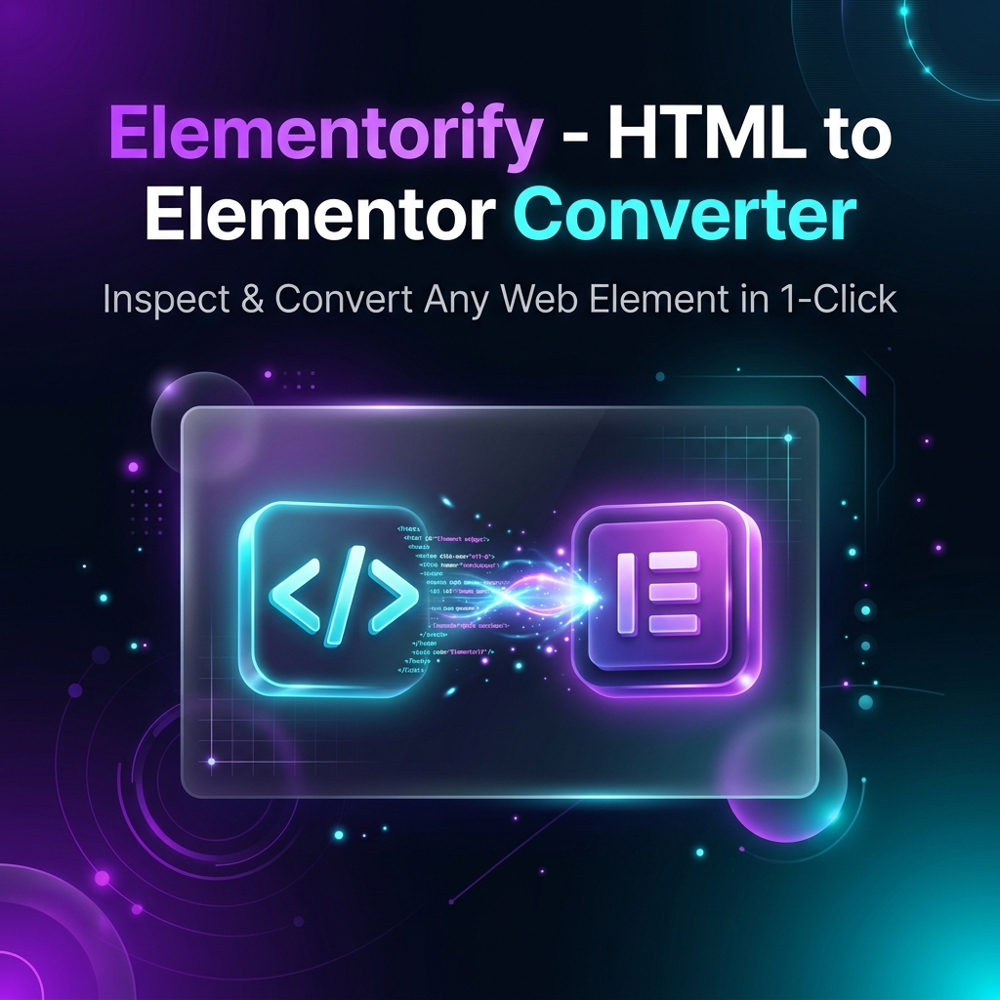
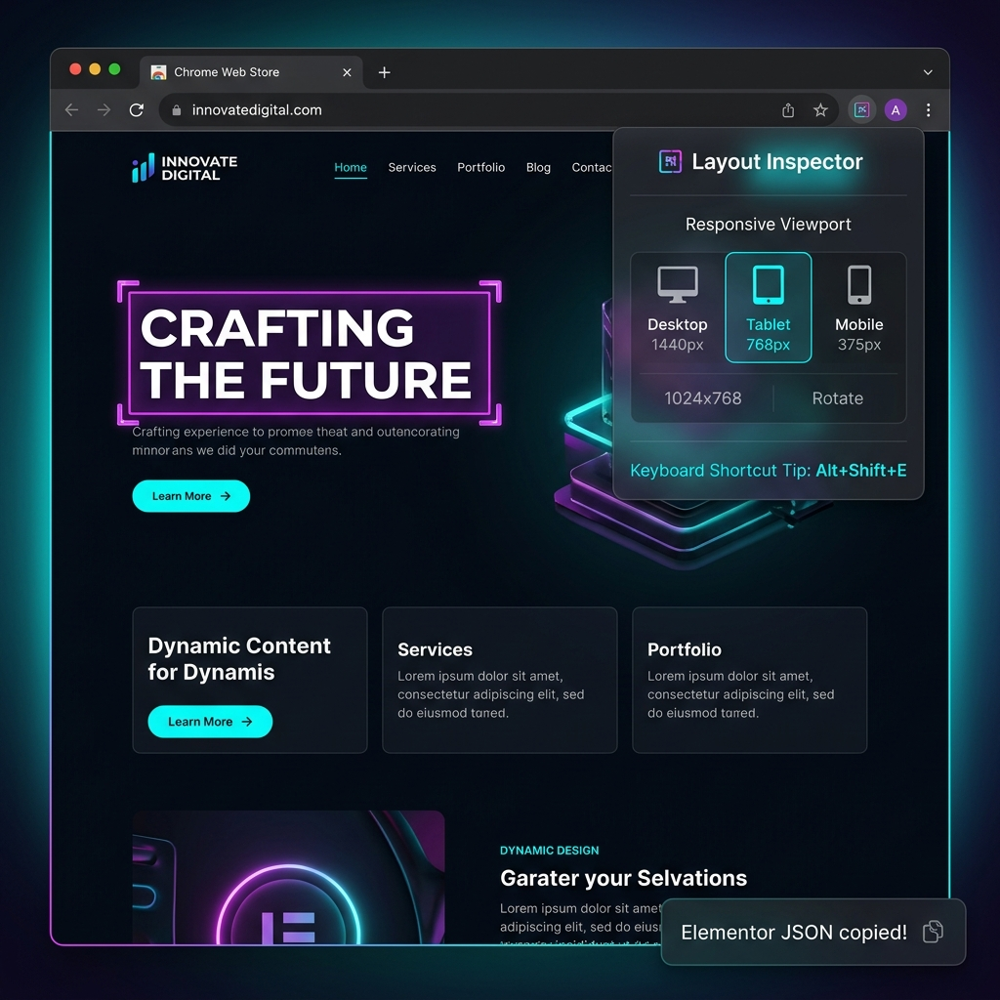

# Elementorify — HTML to Elementor Converter 🚀


**Elementorify** is a commercial-grade Google Chrome Extension (Manifest V3) that converts any web page HTML element, component, or full layout directly into native **WordPress Elementor 4.0 (Atomic Design System)** and **Elementor 3.x** JSON for 1-click pasting into Elementor Editor.

---

## 📸 Chrome Web Store Screenshots





---

## ✨ Key Features

- ⚛️ **Elementor 4.0 Atomic Architecture**: Native payload schema generation for Elementor 4.0 (`e-div-block`, `e-flexbox`, `e-grid`, `styles`, `editor_settings`) + Elementor 3.x dual-engine compatibility.
- 🎯 **Visual Element Inspector**: Hover over any live web page element with neon visual highlights and instant element selector.
- 🔔 **Shadow DOM Copy Toast Notifications**: Isolated, glassmorphic toast notification feedback on element capture with instant clipboard paste alerts.
- ⚡ **Native Elementor Format Payload**: Outputs clean `{ "type": "elementor", "version": "0.0", "siteurl": "", "elements": [...] }` clipboard JSON accepted by Elementor Editor without warnings.
- 🖼️ **Absolute Asset URL Resolution**: Automatically converts relative image, SVG, logo, link, and background asset URLs to full absolute URLs so images clone 100% cleanly.
- 🎨 **Popup Accent Customizer**: Live theme switcher (Electric Purple, Cyber Cyan, Emerald Green, Sunset Amber) with persistent preferences.
- ⌨️ **Global Keyboard Shortcut**: Press `Alt + Shift + E` (Mac: `Option + Shift + E`) anywhere to trigger the inspector instantly.
- 📱 **Responsive Viewport Emulation**: Test layouts across Desktop (1920x1080), Tablet (768x1024), and Mobile (375x812) using Chrome Debugger Emulation.
- 🧪 **Automated Test Suite**: Includes TypeScript exporter test suite (`npm test`) covering v4 Atomic & v3 Legacy schemas.

---

## ⌨️ Keyboard Shortcuts

| Shortcut | Action |
| :--- | :--- |
| `Alt + Shift + E` | Toggle Elementorify Visual Inspector |
| `Esc` | Cancel Inspection Overlay |

---

## 🛠️ Development & Building

```bash
# Install dependencies
npm install

# Run automated unit tests (v4 Atomic & v3 Legacy schemas)
npm test

# Build extension bundles
npm run build

# Package production ZIP
npm run package
```

---

## 📄 License

[MIT License](LICENSE) • Built for WordPress & Elementor developers worldwide.
